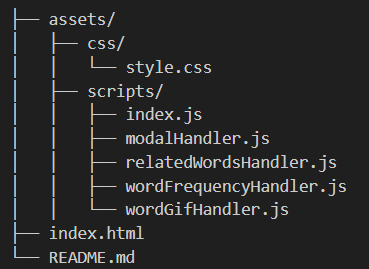
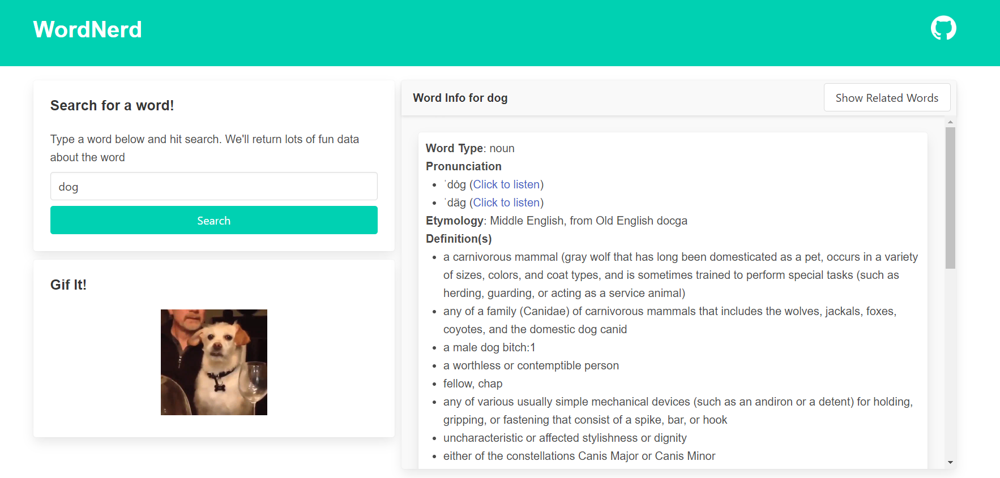

# 📚 WORDNERD

## 💡 Table of Contents

* Project Description
* Key Features
* Installation
* Usage
* File Structure
* Technologies Used
* Contributing
* License
* Acknowledgments

## ✍🏻 Project Description

This project is a web application designed to enhance vocabulary exploration. Users can input a word, search for its definitions, etymology, and related content. The app displays related words, synonyms, antonyms, and a random gif associated with the word in a Bulma-styled modal.

## 🔑 Key Features

* Search for a Word: Input any word to initiate a search.
* Get Word Info: Fetch detailed information, including definitions and etymology of the word.
* Random Gif: Retrieve and display a random gif associated with the word.
* Synonyms & Antonyms in Modal: View a list of synonyms and antonyms displayed in a responsive modal.

## 💽 APIs

In order for this site to function, three API keys must be set in local storage. This can be accomplished by running the following commands in the browser console:
- storeGiphyApiKey('your-key-here');
- storeThesaurusAPIKey('your-key-here');
- storeWordInfoAPIKey('your-key-here');

Instructor/Graders: The API keys for this site have been provided in the assignment comments section along with the repo hyperlink and git pages link.

## Usage

To use the application, open the index.html file in your browser. Input a word, click the "Search" button to fetch word information, or click the "Show Related Words" button to view synonyms and antonyms in the modal.

##  🗄️ File Structure

## Technology Used

* HTML5: Markup language
* CSS3: For styling
* JavaScript: For interactivity
* Bulma: CSS framework for styling
* Merriam-Webster's Collegiate Dictionary with Audio, API Ninja Thesaurus API,  GIPHY API 

## 📷 Site Screenshot

## 🔗 Site Hyperlink

https://ucbx-2024-team-wombat.github.io/WordNerd/

## 🤝 Contributing
If you wish to contribute to this project, please fork the repository and use a feature branch. Pull requests are warmly welcome.

## 📝 License

This project is licensed under the MIT License - see the LICENSE file for details.

##  🙌 Acknowledgments

Thanks to Bulma for their great CSS framework, Merriam-Webster's Collegiate® Dictionary with Audio, API Ninjas and Giphy Devolopers for their great API.

